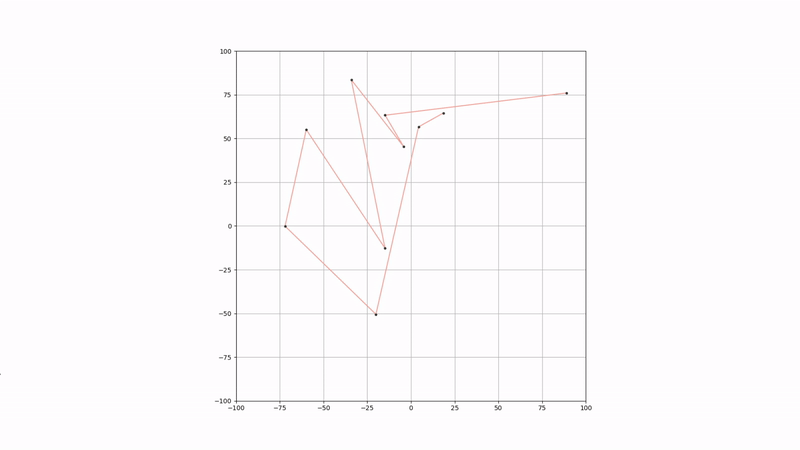

# Waypoint Generator

A simple python script to export generated waypoints into a CSV file. Waypoints can either be user-selected or randomly selected.

[](https://lgtm.com/projects/g/winstxnhdw/WaypointGenerator/alerts/)
[](https://lgtm.com/projects/g/winstxnhdw/WaypointGenerator/context:python)

## Table of Contents

- [Installation](#Installation)
- [Usage](#Usage)
- [User Selected Waypoints](#User-Selected-Waypoints)
- [Randomly Generated Waypoints](#Randomly-Generated-Waypoints)
- [Circular Generated Waypoints](#Circular-Generated-Waypoints)
- [Additional Information](#Additional-Information)

## Installation

Install dependencies

```bash
pip install matplotlib
```

Optional install for circular waypoint generation

```bash
pip install numpy
```

## Usage

```bash
# Run the script
$ python main.py <flag> <value>
```

```yaml
Optional arguments:
-h, --help      show this help message and exit
-r, --random    generates a user-selected amount of random waypoints
-c, --click     generates user-selected waypoint positions   
```

>Press `Z` to undo a selected waypoint or revert to a previously generated set of waypoints.
>
>Press `X` to clear selected waypoints or to generate a new set of randomly generated waypoints.
>
>Press `C` to connect the last and first waypoints.
>
>Generated waypoints are **only exported at exit**.

## User Selected Waypoints


```bash
$ python main.py -c
```

<div align="center">
	
</div>

## Randomly Generated Waypoints

>The generated waypoints are passed piecewise through an algorithm that ensures that each line segment never intersects with each other.
>
```bash
$ python main.py -r <number-of-waypoints>
```

<div align="center">
	
</div>

## Circular Generated Waypoints

`circle_wp_gen.py` is a CLI script for generating waypoints of a certain radius and smoothness. The user can choose to define smoothness with point density or the angle between every point.

```bash
$ cd circle
$ python circle_wp_gen.py -a <x-radius> -b <y-radius>
```

```yaml
Optional arguments:
-h, --help       show this help message and exit
-a, --xradius    radius of an ellipse on the x-axis
-b, --yradius    radius of an ellipse on the y-axis 
```

> The `numpy` library is required to run this script.

<div align="center">
	
</div>

## Additional Information

Exported waypoints can be imported using the `pandas` or `csv` module.

`pandas` module example

```python
from pandas import read_csv

df = read_csv('waypoints.csv')
x = df['X-axis'].values
y = df['Y-axis'].values
```

`csv` module example

```python
import csv

with open('waypoints.csv', newline='') as f:
    rows = list(csv.reader(f, delimiter=','))
    x, y = [[float(i) for i in row] for row in zip(*rows[1:])]
```
